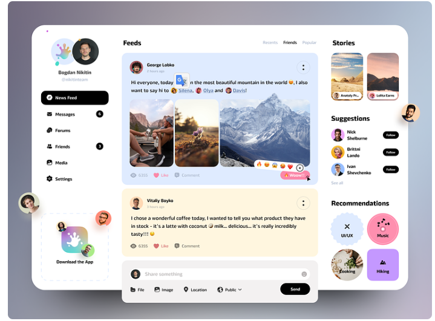
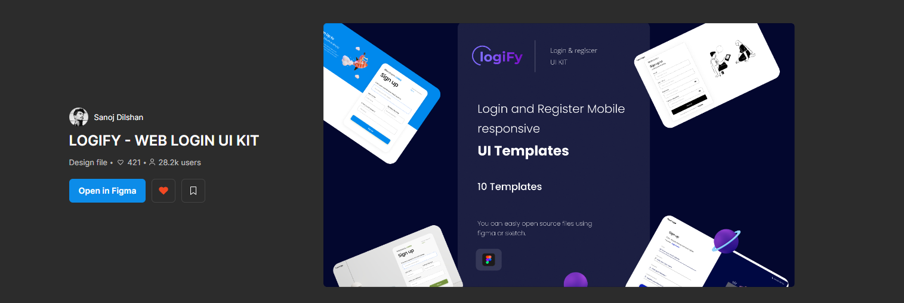

# 🐦 Clon de Twitter — Proyecto TFG

Este proyecto es un **Trabajo de Fin de Grado (TFG)** desarrollado con fines didácticos. Se trata de un clon funcional de Twitter, creado con **Next.js**, **React.js** y **Tailwind CSS**, y desplegado en **Vercel**.

## 🚀 Objetivos del Proyecto

* Aprender y aplicar conceptos de **React**, **Next.js**, **HTML** y **CSS**.
* Profundizar en herramientas del ecosistema moderno de desarrollo web (Prisma, Tailwind, NextAuth, etc.).
* Implementar funcionalidades reales de una red social como Twitter.

---

## ⚙️ Tecnologías Utilizadas

* **Next.js** (App Router)
* **React**
* **Tailwind CSS**
* **Prisma ORM**
* **PostgreSQL**
* **NextAuth** (no implementado aún)
* **Socket.io** (no funcional por el momento)

---

## ✨ Funcionalidades Implementadas

* Autenticación de usuarios (⚠️ aún no funcional/redirecciona correctamente)
* Publicación de tweets
* Dar "me gusta"
* Retweet
* Comentarios
* Seguir/dejar de seguir usuarios

---

## 🧩 Pendiente por Mejorar

* 🔄 **Redirecciones**: Actualmente la raíz de la app (`/`) **no redirige** automáticamente al login ni al dashboard. Esto está pendiente de implementación.
* 💬 **Sección de chats**: aún **no funcional**.
* 🔐 **NextAuth**: no ha sido completamente configurado.
* 🧪 **Testing**: No se han implementado pruebas aún.
* 📱 **Responsive design**: parcialmente adaptado, falta pulir en dispositivos móviles.

---

## 🎨 Inspiración en Diseño

### ✏️ [Nixtio en Dribbble](https://dribbble.com/Nixtio)



### 📐 [Logify Web Login UI Kit en Figma](https://www.figma.com/file/DLbzjzDSNZE8S3hS5dRpsu/LOGIFY---WEB-LOGIN-UI-KIT-%28Community%29?type=design&node-id=0-1&mode=design&t=OrBOJaYz05D7kAPE-0)



---

## 🛠️ Instalación Local

Clona el repositorio y ejecuta el servidor de desarrollo:

```bash
git clone https://github.com/tu-usuario/twitter-clone-tfg.git
cd twitter-clone-tfg
pnpm install
pnpm dev
```

También puedes usar `npm`, `yarn` o `bun` si lo prefieres.

---

## 📝 Notas Finales

Este proyecto está en desarrollo y sirve como base para aprender y mejorar habilidades de desarrollo web fullstack moderno.

> Si tienes sugerencias o encuentras errores, ¡estaré encantado de recibir feedback!

---
